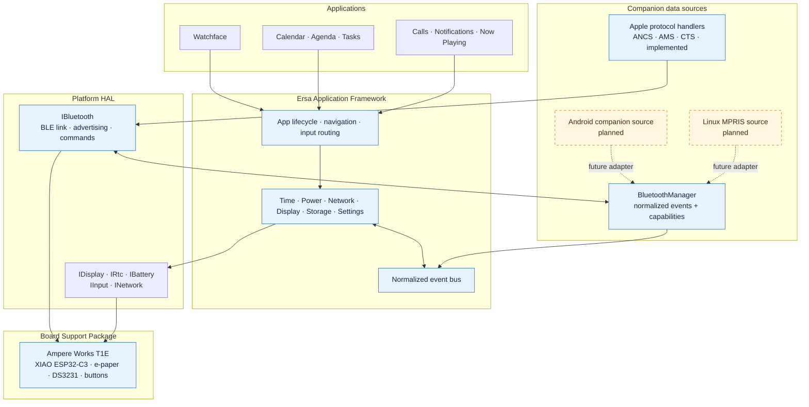

# Ersa Wearable Platform (EWP)

An open-source, modular embedded operating environment and minimalist smartwatch firmware for the **Ampere Works T1E**, inspired by the iconic **Pebble Text Watch** aesthetic.

---

## Visual Showcase

<p align="center">
  
  &nbsp;&nbsp;&nbsp;&nbsp;
  
  &nbsp;&nbsp;&nbsp;&nbsp;
  
  &nbsp;&nbsp;&nbsp;&nbsp;
  
</p>

<p align="center">
  <em>Text Watchface &bull; App Drawer &bull; CalDAV Tasks &bull; CalDAV Agenda</em>
</p>

<p align="center">
  
</p>

<p align="center"><em>Host-rendered 200×200 notification, call, and now-playing screens</em></p>

---

## Ersa Wearable Platform — Layered Architecture

Ersa Wearable Platform is a layered embedded watch environment. The diagram follows the layered, framework-over-HAL style used by Android Open Source Project architecture diagrams. Solid paths are implemented today; dashed paths show intended provider extension points.



Apple ANCS, AMS, and CTS are one current companion source. `IBluetooth` now owns only the BLE link, advertising, and transport maintenance; `ICompanionSource` owns source identity, availability, capabilities, normalized callbacks, and commands. `BluetoothManager` receives these contracts independently, so a provider can run without BLE. The ESP32 board currently composes both roles in one driver object, while tests inject separate transport and source objects. Android companion support and Linux MPRIS are planned adapters; they are not implemented yet.

---

## Key Features

- **Pebble Text Watchface**:
  - Full-bleed black background with pure white typography.
  - Natural time spelled out in English words using Xiaomi's official **MiSans Latin Bold & Light** fonts.
  - Lowercase natural date with ordinal suffix (e.g. `monday` / `september 28th, 2026`).
  - Distraction-free: battery or sync alerts only appear when active or low.
- **Fast, Flicker-Free Partial Refresh**:
  - Panel controller kept energized during user interaction for **~450ms raw partial updates** with zero black/white blinking.
  - Display refresh bug resolved: screen only redraws on minute ticks, button clicks, or state changes.
  - Automatic light sleep is managed by the power policy after inactivity; exact sleep residency depends on active BLE/peripheral locks.
- **Multi-Tier Clock Calibration & NTP Fallbacks**:
  - **Tier 1 (SNTP Pool)**: Multi-server SNTP UDP sync (`pool.ntp.org`, `time.google.com`, `time.cloudflare.com`, `time.apple.com`, `time.nist.gov`).
  - **Tier 2 (HTTP Time Fallback)**: If UDP port 123 is blocked by a cellular phone hotspot or guest Wi-Fi, the watch automatically falls back to HTTP Date header sync (`clients3.google.com`, `worldtimeapi.org`, `cloudflare.com`) over port 80 TCP, guaranteeing accurate time calibration in any network environment.
  - Automatically adjusts the onboard **DS3231 RTC** to exact local time with configurable timezone offsets.
- **Nextcloud & CalDAV Cloud Sync**:
  - **CalDAV Agenda**: Filters events specifically for **today**, supporting standard events and recurring rules (`FREQ=DAILY`, `FREQ=WEEKLY`) with `UNTIL` expiration checking.
  - **CalDAV Tasks**: To-do checklist with instant on-watch toggling (`[ ]` $\leftrightarrow$ `[x]`), prioritizing active/open tasks.
  - **Cache Expiration**: Saved events in NVS are automatically validated against the current day, eliminating stale yesterday events.
- **Centralized String & Fallback Configuration**:
  - All default URLs, server pools, timeouts, preferences namespaces, and UI labels are maintained in `include/ersa/config/system_defaults.h` and `include/ersa/config/ui_strings.h` — zero hardcoded magic literals in application logic.
- **On-Demand Captive Portal Hotspot**:
  - Launch `ErsaWatch-Config` AP from the watch drawer to configure Wi-Fi credentials, CalDAV server, calendar presets (`murena-team`, `personal`, `tasks`), timezone, and time format (12h / 24h).
- **Battery Sensing**:
  - Hardware ADC battery monitoring on GPIO2 (A0) with multi-sample averaging and lithium discharge curve mapping.
- **iPhone ANCS and AMS**:
  - Automatic Apple service discovery after BLE authentication, with separate notification and call queues to handle the initial notification burst.
  - ANCS notification attributes are reassembled across BLE fragments and matched to their notification UID. B2 dismisses the selected alert on the watch, and also sends iOS's advertised action when its label explicitly means “Dismiss” or “Clear.”
  - Incoming calls show caller information when ANCS provides it. B1 sends the available positive action; B2 sends the negative action. ANCS does not provide a complete active-call or dial interface.
  - AMS shows track title, artist, and playback state, and sends supported play/pause and track controls. Call, media, and notification screens share an open monochrome layout.
  - Status reports connection and Apple service readiness. B1 schedules BLE advertising again when disconnected; advertising start is checked and retried after a disconnect.
- **Portable Protocol Decoders**:
  - ANCS and AMS byte decoding is independent of the ESP32 BLE transport. `ICompanionSource` is the normalized provider contract; MPRIS and Android adapters are planned, not included yet.

- **USB development control (`ewctl`)**: Read system, battery, BLE, power, and diagnostic-log status; log power telemetry to CSV; create a redacted support bundle; flash checksum-verified GitHub releases; decode saved panic core dumps. See the [feature catalog](docs/FEATURES.md) and [USB control guide](docs/ewctl-control-bridge.md).
- **Firmware flashing (`ewctl flash`)**: Flash a downloaded app image or factory image through the ESP32-C3 ROM bootloader using the same validated script as the firmware workflow.

---

## Hardware Specifications

| Component | Specification | Details |
| :--- | :--- | :--- |
| **Target Board** | Ampere Works T1E | Compact form factor featuring Seeed Studio XIAO ESP32-C3 |
| **MCU** | ESP32-C3 | RISC-V 160 MHz, 320 KB SRAM, 4 MB Flash, Wi-Fi & BLE |
| **Display** | 1.54" E-Paper Display | 200×200 Monochrome (GxEPD2 / SSD1681), partial refresh capable |
| **RTC** | Maxim DS3231 | High-precision I2C RTC (address `0x68`) with backup cell |
| **Buttons** | Dual tactile switches | Upper `B1` = GPIO4 (D2), Lower `B2` = GPIO3 (D1) |
| **Battery** | LiPo sensing | GPIO2 (A0) via voltage divider |

---

## 2-Button Navigation System

```
                  ┌─────────────────┐
                  │ B1 (Upper GPIO4)│ ──> Click: SCROLL (Down / Next)
                  │                 │ ──> Hold:  MENU / EXIT (App Drawer / Clock)
  [Ersa Watch]    ├─────────────────┤
                  │ B2 (Lower GPIO3)│ ──> Click: OK / ACTION (Select / Toggle / Sync)
                  │                 │ ──> Hold:  QUICK SYNC (CalDAV & NTP)
                  └─────────────────┘
```

| Screen | B1 (Click) | B2 (Click) | Hold B1 | Hold B2 |
| :--- | :--- | :--- | :--- | :--- |
| **Watchface** | Open App Drawer | Quick CalDAV Sync | Open App Drawer | Quick CalDAV Sync |
| **App Drawer** | Scroll selection down | Launch selected app | Return to Clock | — |
| **Calendar** | Advance month (`+1 mo`) | Reset to current month | Return to Drawer | — |
| **Agenda** | Scroll event cards | Sync CalDAV events | Return to Drawer | Sync CalDAV |
| **Tasks** | Scroll checklist items | Toggle task (`[x]`) | Return to Drawer | Sync CalDAV |
| **Hotspot** | Refresh status | Start / Stop AP | Return to Drawer | Sync NTP |
| **Status** | Restart BLE advertising when disconnected | Sync NTP Time | Return to Drawer | Sync NTP Time |
| **Notifications** | Next alert | Dismiss selected alert from watch | Return to Clock | Return to Clock |
| **Incoming call** | Answer | Decline | Return to Clock | Decline |
| **Now playing** | Next track | Play / pause | Return to Drawer | Previous track |

Notification dismissal always removes the selected alert from the watch's history. When iOS advertises a negative ANCS action labeled “Dismiss” or “Clear,” the watch also requests that action on the phone. Other negative actions are left untouched; ANCS actions vary by notification and are not a universal remove command. Later updates for a locally dismissed UID stay hidden until iOS removes that UID or a new ANCS session begins.

---

## Project Structure

```
Ersa-W1/
├── include/
│   ├── ersa/
│   │   ├── app/                   # Application framework & lifecycle
│   │   ├── board/                 # BSP interfaces, configurations & pin contract
│   │   ├── config/                # Centralized system defaults & UI strings
│   │   ├── events/                # EventBus & typed Event definitions
│   │   ├── hal/                   # Hardware abstraction interfaces (IDisplay, IRtc, Bluetooth, etc.)
│   │   ├── protocols/             # Portable ANCS and AMS decoding
│   │   ├── services/              # System services (Time, Power, Network, Storage)
│   │   ├── ui/                    # Canvas drawing abstractions
│   │   └── system.h               # System facade
│   └── fonts/
│       └── misans_fonts.h         # MiSans Latin Bold & Light GFX fonts
├── src/
│   ├── apps/
│   │   ├── app_agenda.*           # CalDAV events card viewer
│   │   ├── app_calendar.*         # Interactive monthly calendar
│   │   ├── app_drawer.*           # App launcher with white capsule cursor
│   │   ├── app_portal.*           # Wi-Fi captive configuration portal
│   │   ├── app_status.*           # Hardware diagnostics & battery stats
│   │   ├── app_todo.*             # CalDAV to-do checklist
│   │   └── apps_registry.*        # App registration & EWP bridge
│   ├── bsp/
│   │   └── ampere/xiao_esp32c3/terra/ # Ampere Terra board support package
│   ├── core/
│   │   ├── battery.*              # ADC voltage & battery curve calculations
│   │   ├── buttons.*              # OneButton debounce & event dispatcher
│   │   ├── debug_log.*            # USB Serial logging & boot crash records
│   │   ├── net_sync.*             # NTP & HTTP Time sync, CalDAV parser
│   │   ├── watch_clock.*          # DS3231 RTC driver & time caching
│   │   └── watch_config.*         # NVS non-volatile settings storage
│   ├── ersa/                      # Core OS implementation (EventBus, Services, etc.)
│   ├── hal/                       # ESP32 concrete HAL implementations
│   ├── ui/
│   │   ├── watch_icons.*          # Monochrome bitmaps
│   │   └── watch_ui.*             # Display controller & refresh scheduler
│   ├── watchfaces/
│   │   └── watchface_clock.*      # Pebble Text Watch watchface
│   └── main.cpp                   # System boot & execution loop
├── tests/
│   ├── mocks/                     # Mock HAL devices for host unit testing
│   ├── ui_preview/                # Host stubs and 200×200 screen simulation
│   └── main_test.cpp              # Core unit test suites
├── platformio.ini                 # PlatformIO build configuration
├── Makefile                       # Top-level makefile (make firmware / make test)
└── scripts/
    ├── pio.sh                     # Self-contained PlatformIO CLI bootstrap
    └── render_ui_preview.sh       # Adafruit GFX + ImageMagick screen preview
```

---

## Build & Test Workflow

### 1. Run Unit Tests (Host GCC)
Run the host tests:
```bash
make test
```

### 2. Compile Firmware (Target Board)
Compile the production firmware using PlatformIO:
```bash
make firmware
```

The firmware targets ESP32-C3 with Arduino as an ESP-IDF component. ESP-IDF owns
project configuration and FreeRTOS power management. Tickless idle and Bluetooth
modem sleep are enabled in `sdkconfig.defaults`; the application uses inactivity
and peripheral activity to govern automatic light sleep. `ota_ab.csv` reserves
two equal app slots and rollback metadata while preserving the existing coredump
region. The old SPIFFS region was unused and is reclaimed for OTA slot 1.
Battery runtime and exact sleep residency still need measurement on the assembled
watch.

The generated firmware remains at `.pio/build/ErsaWearable/firmware.bin`. Run
`make test` for the host-side protocol and service tests.

The `Firmware` GitHub Actions workflow also builds on pull requests and pushes to
`master`, then stores the application image and factory image as a 30-day workflow
artifact. To publish downloadable firmware under **GitHub Releases**, push an
`ewp-*` version tag. Release notes live in `release-notes/` and the cumulative
project history is in [CHANGELOG.md](CHANGELOG.md):

```bash
git tag ewp-0.1.5
git push origin ewp-0.1.5
```

Each tagged release includes `firmware.bin`, `ewp-factory.bin`, migration
components, checksums, and flashing instructions. Existing watches need a
one-time partition migration before OTA updates can be used. The migration
script preserves saved Wi-Fi and watch settings; factory flashing resets them.
After migration, the updater app checks its codename-scoped HTTPS manifest,
verifies device identity and the downloaded image hash, writes the inactive slot, and relies on bootloader
rollback until the new firmware confirms stable startup. See `FLASHING.md`.

### 3. Flash to Device
For a new watch, download `ewp-factory.bin` from a GitHub Release, connect the
Ampere Works T1E via USB-C, then run the one-command flasher:

```bash
./scripts/flash_firmware.sh ~/Downloads/ewp-factory.bin
```

The script chooses the factory or app offset from the image name and detects a
single connected serial port. With no image argument, it prefers the locally built
app image to preserve settings. If more than one port is available, pass it explicitly:
`./scripts/flash_firmware.sh ~/Downloads/ewp-factory.bin /dev/ttyACM0`. With no image
argument it uses a locally packaged factory image, or falls back to the local build's
`firmware.bin` app image. Factory flashing resets saved watch settings.

For an existing watch, download `bootloader.bin`, `partitions.bin`,
`boot_app0.bin`, `firmware.bin`, and `migrate_ota.sh` from the same release into
one directory, then run the migration script. It preserves NVS settings but
reclaims the unused SPIFFS region for the second app slot:

```bash
bash ./migrate_ota.sh . /dev/ttyACM0
```

Do not interrupt the migration. It updates the bootloader and partition table
as well as the app image. This prepares the watch for rollback-capable OTA and
the on-watch updater.

### 4. Serial Monitor
```bash
bash scripts/pio.sh device monitor
```

### 5. Simulate UI Screens with ImageMagick

After `make firmware` has installed Adafruit GFX, run this on a host with `g++` and ImageMagick (`magick`):

```bash
./scripts/render_ui_preview.sh
```

The script compiles the production notification, call, and now-playing renderers against Adafruit GFX's 200×200 host canvas. ImageMagick joins and doubles the pixel size for the [preview](docs/images/notification_call_media_simulation.png). It renders simulated notification, caller, and track data; no device or BLE connection is needed. These previews verify layout, while device testing is still needed for button timing and e-paper refresh.

### 6. USB Development Control

Install the host dependencies with `python3 -m pip install -r requirements-ewctl.txt`.
Examples (close any other serial monitor first):

```bash
python3 scripts/ewctl.py --port /dev/ttyACM0 status
python3 scripts/ewctl.py --port /dev/ttyACM0 power
python3 scripts/ewctl.py --port /dev/ttyACM0 power cpu-freq-get
python3 scripts/ewctl.py --port /dev/ttyACM0 power cpu-freq-set 40
python3 scripts/ewctl.py --port /dev/ttyACM0 power cpu-freq-set 0
python3 scripts/ewctl.py --port /dev/ttyACM0 flash ~/Downloads/firmware.bin
python3 scripts/ewctl.py --port /dev/ttyACM0 flash release 0.1.3
python3 scripts/ewctl.py --port /dev/ttyACM0 power log --interval 30 --duration 3600
python3 scripts/ewctl.py --port /dev/ttyACM0 debug bundle
python3 scripts/ewctl.py --port /dev/ttyACM0 debug coredump
```

`ewctl` displays readable Rich tables by default; add `--json` for scripts.
Frequency profile changes are applied during a controlled reboot; 0 restores
automatic 40–160 MHz power management. See the [USB control guide](docs/ewctl-control-bridge.md).

For Arch Linux, install the release repository by adding this to
`/etc/pacman.conf`:

```ini
[ersa-ewctl]
SigLevel = Optional
Server = https://pkgs-wearables.ersa.dev/
```

Then run `sudo pacman -Syu ewctl`. The package-only repository is hosted at
[pkgs-wearables.ersa.dev](https://pkgs-wearables.ersa.dev/); tagged GitHub
builds publish directly to the `gh-pages` branch, and tagged GitHub releases
also include the package and repository metadata. The Pages source is the root
of that branch; it contains only the package index, archives, and landing page.
Alternatively, build `packaging/arch/ewctl/PKGBUILD` with `makepkg -si`.

---

## Initial Setup via Wi-Fi Portal

1. On the watch, press **`B1`** to enter the App Drawer, scroll to **`hotspot`**, and press **`B2`** to start the AP.
2. Connect your phone or computer to the Wi-Fi network:
   - **SSID**: `ErsaWatch-Config`
   - **Password**: `12345678`
3. A captive portal page will automatically open (or navigate to `http://192.168.4.1`).
4. Enter your home Wi-Fi credentials, Nextcloud/Murena CalDAV URL, username, and app password.
5. Select **Save & Sync NTP Time**. The watch will connect, calibrate the DS3231 RTC (via SNTP or HTTP Date fallback), download your daily events and tasks, and power down the radio to conserve energy.

---

## Adding Support for New Boards

Ersa Wearable Platform is designed to be hardware-agnostic. To add support for a new board, display, or MCU, see the comprehensive guide:
- 📖 [**Adding Board Support to Ersa Wearable Platform**](docs/ADDING_A_BOARD.md)

---

## License

This project is licensed under the MIT License - see the [LICENSE](LICENSE) file for details. Designed and crafted for the open-source hardware community.
