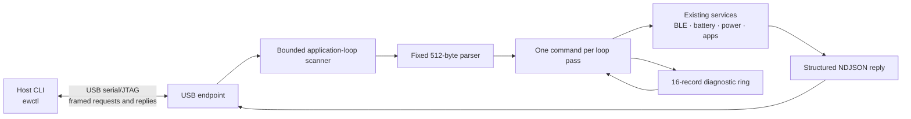

# `ewctl` Device Control Bridge

## Goal

Provide a small, scriptable USB control surface for inspecting and operating an Ersa watch during development. The host tool should feel familiar to someone who has used `adb`, while remaining a narrow Ersa protocol rather than implementing the ADB protocol. It must coexist with normal watch operation: USB commands cannot block the UI loop, BLE callbacks, display work, or power management.

The first transport is the ESP32-C3 USB Serial/JTAG console. Keep the protocol transport-neutral so a later BLE or network transport can reuse command handling with a separate policy.

`ewctl ota` reports the selected board's name, codename, manufacturer, running app slot, ESP-IDF image state, the other slot's bootability, update target, partition sizes, and whether rollback confirmation is pending. `ewctl ota boot-other` validates the alternate image, selects it through ESP-IDF OTA metadata, replies over USB, then reboots into it. The equivalent updater-screen shortcut is a B2 double-click. `ewctl status` includes compiled firmware version, name, codename, manufacturer, running slot, and a human-readable current boot uptime. `--json` retains the raw `version` and `uptime_seconds` fields.

The host client lives at `scripts/ewctl.py` and uses Python, `pyserial`, and Rich (`python3 -m pip install -r requirements-ewctl.txt`). It renders readable Rich tables by default; pass `--json` for machine-readable output. Examples: `python3 scripts/ewctl.py status`, `python3 scripts/ewctl.py power cpu-freq-set 40`, `python3 scripts/ewctl.py poll status battery ble power --interval 5`, and `python3 scripts/ewctl.py logs --follow`. Follow mode streams the live USB console without sending `logs.read` requests; redirect it with `python3 scripts/ewctl.py logs --follow > watch.log` or use `logs --output watch.log`. `logs --raw` also selects direct raw console capture. Stop raw capture with Ctrl-C. Pass `--port /dev/ttyACM0` if auto-detection is ambiguous. The firmware endpoint is implemented in `src/core/usb_control.cpp`; the watch must run a build containing it.

Use `ewctl version` to print the installed CLI release, six-character Git hash,
and source branch without connecting to the watch. Arch package builds pull
their CLI source from `master` and embed the hash of the `master` commit used
for that package; a tag-triggered release does not package the tag's CLI tree.

`ewctl flash firmware.bin` flashes an app image through the ESP32-C3 ROM bootloader. `ewctl flash ewp-factory.bin` flashes the factory image and resets saved settings. The image argument can be omitted to use the local build. Tagged GitHub releases can be downloaded, verified against their SHA-256 manifest, cached, and flashed with `ewctl flash release 0.1.3`; use `latest` for the latest stable release and `--factory` for its factory image. This uses the same ROM bootloader process and esptool wrapper as `scripts/flash_firmware.sh`, not the USB control bridge. The app-image path writes the fixed `ota_0` address; after migration to the dual-slot table, use the on-device `updater` app for routine Wi-Fi updates because it selects the inactive slot and keeps bootloader rollback metadata consistent.

`ewctl power get-dvfs-state` captures ESP-IDF's current PM lock and CPU residency report on demand. It reports the measured CPU clock, lock counts/timing, and time in each PM mode, including sleep. `ewctl power log` samples battery voltage, CPU frequency, power state, BLE state, uptime, and heap to a timestamped CSV. Set `--interval 30 --duration 7200 --output run.csv`; duration `0` records until Ctrl-C. USB monitoring blocks the watch's normal sleep policy, so this helps compare telemetry but does not measure normal battery life.

Provision settings over USB with `ewctl config get`. The getter reports which passwords are present without returning their values. Set each group independently with `config wifi`, `config caldav`, `config time`, or `config hotspot`; these commands write the same persisted settings used by the setup portal. The previous flat `config set` form remains available for scripts that already use it:

```sh
ewctl config wifi set --ssid "Ersa" --password 'wifi secret'
ewctl config caldav set --server 'https://dav.example/remote.php/dav' --user 'watch' --password 'dav secret' --calendar 'personal' --todo-path 'tasks'
ewctl config time set --timezone-offset-min 330 --time-format 24h
ewctl config hotspot set --ssid 'Ersa Setup' --password 'setup secret' --timeout-sec 600
ewctl config get
```

Passwords are sent over the USB control bridge and are never returned by
`config get`. Avoid putting secrets directly in shell commands on shared hosts
because shells may save command history.

`ewctl time status` reports the current software wall-time epoch, a direct chip readback epoch, whether the RTC is readable/healthy, whether its oscillator-stop flag is set, and the most recent chip-to-software drift measurement. Drift is marked unavailable until a periodic comparison has run. `ewctl time set <epoch>` writes the watch wall time directly; the epoch is interpreted as the wall-clock value shown on the watch (the firmware stores the phone's local clock fields without applying a timezone conversion).

`ewctl debug bundle` creates a ZIP bug report with status snapshots and up to 16 recent logs. It redacts Wi-Fi SSIDs, tokens, and URLs from log lines. Add `--include-coredump` to decode and include the raw core; that opt-in dump may contain arbitrary task memory and should be reviewed before sharing.

## Panic coredumps

New firmware builds save ESP-IDF panic coredumps in the existing 64 KiB `coredump` flash partition, using ELF format and a CRC32 integrity check. After a panic and reboot, connect USB and decode the saved dump with the exact ELF used to build the flashed firmware:

```sh
python3 -m pip install -r requirements-ewctl.txt
python3 scripts/ewctl.py --port /dev/ttyACM0 debug coredump
```

The command reads the coredump partition over the ROM bootloader, prints task/register/backtrace details, and uses `.pio/build/ErsaWearable/firmware.elf` by default. Retain that ELF for each flashed build: symbols from a different build can produce misleading function names. If the ELF is elsewhere, pass `--elf /path/to/firmware.elf`; if ESP-IDF is installed outside this checkout, pass `--idf-path /path/to/esp-idf`. The decoder also needs the RISC-V ESP GDB toolchain; the local PlatformIO package is detected automatically, otherwise put `riscv32-esp-elf-gdb` on `PATH` or pass `--gdb`. Use `--save-core panic.elf` to retain the extracted dump for sharing. A missing or invalid saved dump is reported by ESP-IDF's decoder.

Core dumps are disabled in firmware builds predating this setting. Flash the new firmware before expecting a panic dump. Since a dump captures task memory, it may include transient notification or other user data; review it before sharing the saved core file.

## Architecture



The endpoint is polled from the firmware application loop. It reads at most 64 bytes and dispatches at most one complete request per pass; it does not create a second task or call application code from a USB callback. A fixed 512-byte line buffer bounds memory use. Status and log handlers are queries; CPU frequency commands are narrowly scoped development settings. Long operations and job polling are not implemented.

The USB transport uses the existing Arduino `Serial` USB Serial/JTAG console. The parser does not depend on a JSON library. Firmware diagnostics are kept in a bounded ring and raw log output is suppressed after the first valid protocol request, preventing log text from corrupting replies.

## Wire protocol

Use newline-delimited JSON (NDJSON) initially. It is easy to inspect with a terminal while remaining straightforward to parse in a host script. Requests are limited to 512 bytes; replies are limited to 2048 bytes so a bounded batch of diagnostic lines fits. Reject overlong or malformed requests and discard input through the next newline after a framing error. Never allocate from an untrusted length field.

Each request includes a protocol version, request ID, command, and optional arguments:

```json
{"v":1,"id":17,"cmd":"battery.read"}
```

A completed command returns exactly one response carrying the same ID:

```json
{"v":1,"id":17,"ok":true,"data":{"millivolts":4126,"percent":97}}
```

Errors are structured and stable for scripts:

```json
{"v":1,"id":17,"ok":false,"error":{"code":"unsupported","message":"Battery telemetry is unavailable"}}
```

The wire format reserves asynchronous job replies for future commands:

```json
{"v":1,"id":18,"ok":true,"job":42,"state":"accepted"}
{"v":1,"event":"job.progress","job":42,"percent":50}
{"v":1,"event":"job.complete","job":42,"ok":true}
```

The current endpoint has no asynchronous jobs or dispatch queue. It processes one request at a time and echoes the request ID. `job.get` returns `unsupported`. Commands must remain idempotent where practical.

## Command model

Implemented commands:

| Command | Result |
| --- | --- |
| `system.status` | Compiled firmware version/build identity, selected-board name/codename/manufacturer, running OTA slot, uptime, reset reason, active app, heap, USB session, power state |
| `battery.read` | Latest voltage and estimated percentage, with sample age and validity |
| `ble.status` | Link and advertising state, active companion source IDs, discovered capabilities |
| `power.status` | CPU frequency/PM mode, sleep eligibility/block reason, active power locks |
| `power.cpu-freq-get` | Measured CPU MHz, active test override, and automatic/forced mode |
| `power.cpu-freq-set` | Queue a 40/80/160 MHz test profile; value `0` restores automatic 40–160 MHz scaling |
| `power.get-dvfs-state` | ESP-IDF power-management lock report and CPU residency per power mode |
| `ota.status` | Running/alternate/update slots, image states, alternate bootability, rollback state |
| `ota.boot-other` | Validate and select the alternate OTA slot, then reboot |
| `logs.read` | Bounded batch of recent diagnostic records, with cursor for pagination |
| `job.get` | State and result for an asynchronous job |

`system.status`, `battery.read`, `ble.status`, `power.status`, both CPU-frequency commands, `power.get-dvfs-state`, both OTA commands, and `logs.read` are implemented. `logs.read` returns up to four records (constrained by the response size) and a `next_cursor`, allowing `ewctl logs --follow` to drain the backlog without one USB round trip per line. `job.get` is reserved and currently returns `unsupported`.

Read the active frequency and override:

```sh
python3 scripts/ewctl.py --port /dev/ttyACM0 power cpu-freq-get
```

Queue a CPU profile for a test, then restore normal dynamic PM scaling:

```sh
python3 scripts/ewctl.py --port /dev/ttyACM0 power cpu-freq-set 40
python3 scripts/ewctl.py --port /dev/ttyACM0 power cpu-freq-set 0
python3 scripts/ewctl.py --port /dev/ttyACM0 power get-dvfs-state
python3 scripts/ewctl.py --port /dev/ttyACM0 ota
python3 scripts/ewctl.py --port /dev/ttyACM0 ota boot-other
```

ESP-IDF's global power policy is applied at boot. A set request returns an acknowledgement and then performs a controlled reboot to apply the profile; it does not reconfigure PM while BLE or peripheral locks are live. The request is held in RTC memory across that restart. `0` restores the automatic 40–160 MHz range. The 40 MHz profile uses a 40 MHz floor and an 80 MHz ceiling because ESP-IDF supports 80/160 MHz CPU maxima; BLE's APB lock can raise the live CPU to 80 MHz. Check the measured clock with `power cpu-freq-get` after the watch restarts.

Follow-up commands can request `agenda.refresh`, `ble.restart-advertising`, or `system.reboot`. Commands that mutate configuration, clear data, or reboot must be explicitly named and return an acknowledgement before execution. Do not provide an arbitrary shell, memory read/write, or unrestricted register command.

Responses should report capability and validity instead of inventing defaults. For example, if battery sampling is unavailable, return `available:false`; if BLE is disconnected, report connection state while keeping discovered capability data clearly marked stale or unavailable.

## Scheduling, sleep, and USB behavior

- Keep USB receive and transmit handling nonblocking and use fixed-size frame storage.
- Read no more than 64 bytes and dispatch no more than one request per loop pass to preserve UI and BLE responsiveness.
- The existing UI sleep guard blocks automatic light sleep while USB CDC is attached because C3 USB Serial/JTAG loses its connection in light sleep. Detaching USB clears protocol mode; there is no separate inactivity lease yet.
- Do not disable BLE power policy merely because USB is attached. Report the exact sleep blocker in `power.status`.
- CPU frequency profile changes trigger a controlled reboot so ESP-IDF PM configuration is set before radio and peripheral locks start. The profile is retained through software restart; `0` returns to automatic scaling. Lower profiles can affect BLE/Wi-Fi responsiveness. `power cpu-freq-get` verifies the measured clock and requested profile.
- USB Serial/JTAG and firmware logs share a physical stream. Diagnostics go to a 16-record in-memory ring and are exposed through `logs.read`. Once a valid request arrives, raw logging is suppressed until USB disconnect so replies remain machine-readable.
- If the host opens or closes the serial port during sleep, recover cleanly. The watch continues its normal boot path and BLE advertising even when no host is present.

## Reliability and validation

The endpoint enforces a 512-byte request bound, required version/ID/command fields, numeric ID parsing, and bounded command names. It discards malformed and oversized lines through the next newline and resumes. CPU frequency inputs are restricted to 0, 40, 80, or 160 MHz. Unsupported valid commands receive a structured error. Full JSON schema/depth validation remains a follow-up before broader mutating commands are introduced.

The host client has unit tests for request framing, size limits, malformed replies, and argument parsing. The firmware has been built and flashed; USB command protocol behavior still needs an on-device pass for attach/detach, command bursts, log cursor polling, BLE activity during a USB session, forced-clock response, and sleep after disconnect.

## Rollout

1. Implemented: Rich Python host CLI, bounded USB request scanner, versioned NDJSON replies, status handlers, temporary CPU-frequency testing, and batched log-ring polling.
2. Validate the parser independently on host and test attach/detach, command bursts, and sleep behavior on hardware.
3. Add explicit schema validation and an inactivity lease if needed before implementing mutating or asynchronous commands.
4. Keep protocol version negotiation backward-compatible as commands are added.
